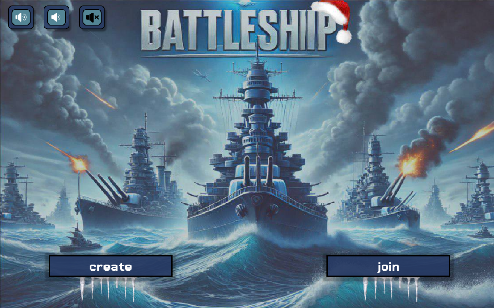
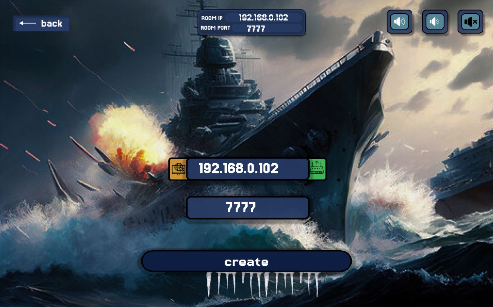
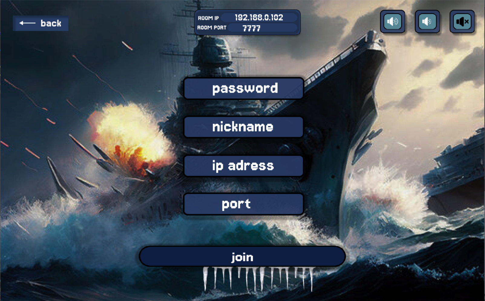
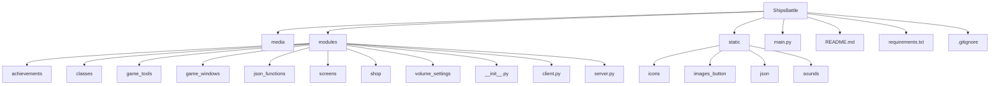
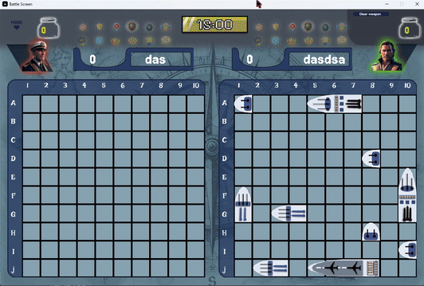
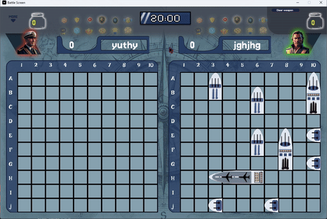
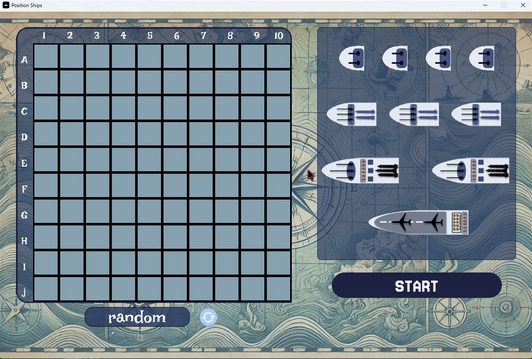
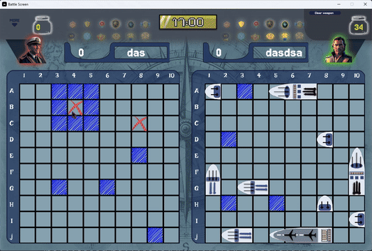
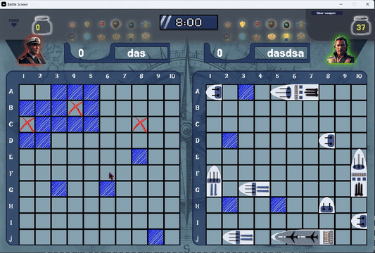

<h1>GAME "Ships Battle"</h1>

---

<a name="articles"><h3>Table of contents</h3></a>

# Project Description  
[Project description](#headers)

# Information about our team 
[Information about our team](#team)

# Figma
[Figma](#figmaa)

# Our project structure  
[structure of project](#structure)

# Getting Started  
[Getting started](#getting_started)

# Modules Description  
[Modules description](#modules)

# Package Description  
-   [Package description](#package_description)
    - [describe achievment package](#achievment)
    - [describe classes package](#classes)
    - [describe game_tools package](#game_tools)
    - [describe game_windows package](#game_windows)
    - [describe json_functions package](#json_functions)
    - [describe screens package](#screens)
    - [describe shop package](#shop)
    - [describe volume_settings package](#volume_settings)

- [client.py package modules](#client)
- [server.py package modules](#server)
- [class_ship.py modules](#class_ship)


# Problems when creating a project
[Problems during development](#prbl_project)

# Conclusion
[Conlusion](#conclusions)

---


<a name="headers"><h1>Project description</h1></a>
Основна мета цього проєкту - закріпити навички роботи з клієнтом, сервером та обміном данних. 
Ships Battle - це гра морський бій для двох людей з можливістю підключитися віддалено або в одній мережі. 
За допомогою введення ip адреса та порту ви можете підключитися та грати спільно з іншим гравцем. 
Ships Battle демонструє базові принципи роботи з клієнтом, сервером і обміном даними через мережу. Гра є чудовим прикладом для тих, хто хоче зрозуміти, як організувати підключення між пристроями за допомогою IP-адрес і портів. Проєкт також дає можливість навчитися працювати з бібліотеками Python, такими як socket і pygame. Ця гра показує, як можна реалізувати віддалений зв'язок у програмі, що буде корисним для розробників, які працюють над створенням багатокористувацьких ігор або додатків із мережевими функціями. Інші розробники можуть використовувати цей проєкт як приклад для створення своїх програм із підтримкою підключення через локальну мережу або інтернет. Завдяки можливості підключення як у межах локальної мережі, так і через інтернет, користувачі можуть легко зрозуміти різницю між цими типами з'єднань, що є важливим аспектом у створенні мережевих додатків. Отже, цей проєкт може бути корисним як для розробників-початківців, так і для тих, хто цікавиться мережею, іграми або програмуванням на Python. Він допоможе зрозуміти важливі технічні концепції та надасть натхнення для створення власних розробок.



Щоб створити гру, потрібно:
 1. ip-адресу, яка приймає запрос від будь-якого користувача(0.0.0.0), або локальну адресу
 2. Ввести порт
 3. ввести пароль
 4. доєднатися до серверу


 
Щоб доєднатись до гри, потрібно:
 1. Ввести свій нікнейм 
 2. Публічну ip-адресу, яку ви можете дізнатись у свого провайдера
 3. Ввести порт
 4. ввести пароль

 

 
 
<details>
<summary> English version </summary>
The main goal of this project is to consolidate skills in working with the client, server and data exchange.
Ships Battle is a sea battle game for two people with the ability to connect remotely or on the same network.
By entering an IP address and port, you can connect and play together with another player.
Ships Battle demonstrates the basic principles of working with the client, server and data exchange over the network. The game is an excellent example for those who want to understand how to organize connections between devices using IP addresses and ports. The project also provides an opportunity to learn how to work with Python libraries such as socket and pygame. This game shows how to implement remote communication in the program, which will be useful for developers working on creating multiplayer games or applications with network functions. Other developers can use this project as an example for creating their own programs with support for connecting via a local network or the Internet. With the ability to connect both within a local network and over the Internet, users can easily understand the difference between these types of connections, which is an important aspect in creating network applications. Therefore, this project can be useful for both novice developers and those interested in networking, gaming, or Python programming. It will help you understand important technical concepts and provide inspiration for creating your own developments.


To create a game, you need:
 1. an ip address that accepts a request from any user (0.0.0.0), or a local address
 2. Enter the port
 3. enter the password
 4. join the server

To join the game, you need:
 1. Enter your nickname
 2. Public IP address, which you can find out from your provider
 3. Enter the port
 4. enter the password
</details>

[⬆️Table of contents](#articles) 

<a name="team"><h1>Information about our team</h1></a>
1. GitHub - [Vova - Developer](https://github.com/Pranichek)
2. GitHub - [David - Developer](https://github.com/Zixtherc)
3. GitHub - [Nazar - Developer](https://github.com/Nazickj2023)
4. GitHub - [Mykhailo - Developer](https://github.com/DeKlain4ik)
4. GitHub - [Lena - Developer, Designer](https://github.com/LenaFedchenko)
4. GitHub - [Kamilla - Developer, Designer](https://github.com/KamillaKrupina?tab=repositories)

[⬆️Table of contents](#articles) 


<a name="figmaa"><h1>Figma</h1></a>

[Link to Figma](https://www.figma.com/community/file/1463238329116517584)


<a name="structure"><h1>Structure of project</h1></a>



[Link to project structure](https://www.figma.com/board/SnEIS3t6Ro3rcaxTK6nRDq/Untitled?node-id=0-1&p=f&t=8ecpCJNVmgIVfyh5-0)

[⬆️Table of contents](#articles)


<a name="getting_started"><h1>Getting started</h1></a>
Нижче наведена інструкція, як встановити гру.

## Installing python
Це приклад того, як встановити python, якщо ви ніколи ним не користуєтесь
- Завантажте інсталятор Python
 - Перейдіть на офіційний [Python website](https://www.python.org)
 - Перейдіть до розділу "Завантаження". Веб-сайт автоматично визначає вашу операційну систему та відображає відповідну версію.
- Виберіть правильну версію
 - Для більшості користувачів рекомендується остання стабільна версія. Але якщо у вас немає останньої версії, спробуйте завантажити іншу.
- Завантажте інсталятор
 - Натисніть кнопку Завантажити Python. Ця кнопка буде у верхньому правому куті екрана.
- Налаштувати параметри встановлення
 - Поставте прапорець «Додати Python до PATH» у нижній частині вікна інсталятора. Цей крок є ключовим для запуску Python з командного рядка
 - Клацніть «Налаштувати інсталяцію», якщо ви хочете вибрати додаткові параметри, але налаштування за замовчуванням добре працюють для більшості користувачів.
- Встановити python
 - Нарешті ви можете натиснути кнопку «Встановити зараз» і дочекатися завершення встановлення.
- Перевірте інсталяцію
    - Після встановлення відкрийте термінал або командний рядок.
        <details>
        <summary> Operating system</summary>
        - On Windows: Press Win + R, type cmd, and press Enter.
        - On macOS/Linux: Open the Terminal application.
        </details>
    - Тип ```python --version``` or ```python3 --version``` та натисніть Enter.
- Якщо Python встановлено правильно, ви побачите встановлену версію

Якщо ви все ще не розумієте, як встановити Python, можете подивитися [тут](https://www.youtube.com/watch?v=YKSpANU8jPE)

[⬆️Table of contents](#articles)

## Installing this project
1. Клонуйте проект
 - Перейшов на головну сторінку проекту на github.
 - Натисніть зелену кнопку «Код», розташовану вгорі праворуч.
 - Виберіть параметр HTTPS і скопіюйте URL-адресу проекту.
2. Відкрийте проект у IDE
 - Запустіть бажану IDE (Vscode, PyCharm або іншу)
 - Відкрийте його та виберіть опцію «Відкрити папку», щоб перейти та відкрити каталог, де було клоновано проект.
 - Натисніть Control + J або просто створіть новий термінал і напишіть це:
```python
    git clone https://github.com/Pranichek/ShipsBattle.git
```
3. Підготуйте проект до використання
 - Перейдіть до головної папки проекту
```python  
    cd ShipsBattle
```
4. Створіть віртуальне середовище

    Для macOS/Linux:

        python3 -m venv venv
    Для Windows:

        python -m venv venv
5. Активуйте віртуальне середовище

    На macOS/Linux:

        source venv\bin\activate
    На Windows:

        venv\Scripts\activate
6. Встановити модулі проекту
 - Коли віртуальне середовище стане активним, інсталюйте необхідні бібліотеки, виконавши:

```python 
    pip install -r requirements.txt 
```
7. Запуск програми
 - Щоб запустити музичний плеєр, використовуйте таку команду:

```python
    python main.py
```


[⬆️Table of contents](#articles)


<a name="modules"><h1>MODULES FOR PROGRAM</h1></a>

### MODULES FOR DOWNLOADING
* **pillow** - image handler/Робота зі створенням зображень з байт коду
* **pygame** - create a game and transform the image/бібліотека для програмування ігор на Python

### BASE MODULES PYTHON

* **socket** - making server and client connections
* **os** - searching absolute path

<a name="achievment"><h1>describe achievment package</h1></a>
У цій папці ми маємо файли, які відповідають за нагороди гравців, тут прораховуються усі можливі попадання по кораблям, наприклад, якщо гравець попав по кораблю за перший хід, то гравець отримує свою першу нагороду. Приклад коду за досягнення 'first hit'.

Нагорода





<details>
<summary>English version</summary>
In this folder we have files that are responsible for player rewards, all possible hits on ships are calculated here, for example, if a player hits a ship on the first turn, then the player receives his first reward.Example code for "pioner".
</details>

```python
    # Функція opening_the_battle має на меті перевірити стан гри у "Морському бою" на основі переданих матриць grid (сітка 
    # +гравця) та enemy_grid (сітка супротивника). Вона підраховує кількість кораблів у кожній сітці та визначає, чи виконано 
    # певні умови для досягнення.
    def opening_the_battle(grid: list , enemy_grid: list):
    if player_ships[0] != 100:
        player_ships[0] = 0
        enemy_ships[0] = 0
        for row in range(len(grid)):
            for cell in range(len(grid[row])):
                if grid[row][cell] in [1, 2, 3, 4]:
                    player_ships[0] += 1
                if enemy_grid[row][cell] in [1, 2, 3, 4]:
                    enemy_ships[0] += 1

        if player_ships[0] == 20 and enemy_ships[0] == 19:
            player_ships[0] = 100
            opening_the_battle_achievement.ACTIVE = True
            opening_battle_medal.ACTIVE = True
            list_save_coords_achiv.append(10)
            list_save_coords_achiv[0] = True
            count_money_hit[0] += 20

```

```python
    # Ця функція реалізує перевірку і активацію спеціальних досягнень на основі знищення кораблів. Головна умова для активації 
    # "Перфекціоніста" — знищити всі типи кораблів один раз без помилок.
    def monster_of_perfictionists():
    if True not in killed_ships:
        if enemy_dies_ships_for_ahiv[0] != "":
                # for killed_ship in enemy_dies_ships_for_ahiv[0]:
            killed_ships[0] =  enemy_dies_ships_for_ahiv[0][index_killed_ships[0]:]

            if 0 in list_hits_achiv or 5 in list_hits_achiv:
                index_killed_ships[0] += 1
                

            if len(killed_ships[0]) == 2:
                for indx , ship in enumerate(killed_ships[0]):
                    if indx > 0:
                        if killed_ships[0][indx - 1] == ship:
                            index_killed_ships[0] += 1
            if len(killed_ships[0]) >= 3:
                if killed_ships[0].count(1) >= 2:
                    index_killed_ships[0] += len(killed_ships[0]) - 1
                elif killed_ships[0].count(2) >= 2:
                    index_killed_ships[0] += len(killed_ships[0]) - 1
                elif killed_ships[0].count(3) >= 2:
                    index_killed_ships[0] += len(killed_ships[0]) - 1
                elif killed_ships[0].count(4) >= 2:
                    index_killed_ships[0] += len(killed_ships[0]) - 1
            
            if len(killed_ships[0]) >= 4:
                if 0 not in list_hits_achiv and 5 not in list_hits_achiv:
                    if 1 in killed_ships[0] and 2 in killed_ships[0] and 3 in killed_ships[0] and 4 in killed_ships[0]:
                        if killed_ships[0].count(1) == 1 and killed_ships[0].count(2) == 1 and killed_ships[0].count(3) == 1 and killed_ships[0].count(4) == 1:
                            killed_ships.append(True)
                            perfictionists_achiement.ACTIVE = True
                            collector_medal.ACTIVE = True
                            list_save_coords_achiv.append(12)
                            list_save_coords_achiv[0] = True
                            count_money_hit[0] += 20
                        else:
                            index_killed_ships[0] += 3
                            list_hits_achiv.clear()
                else:
                    index_killed_ships[0] += 3
                    list_hits_achiv.clear()
```

```python
    # Функція відповідає за перший постріл гравця, перевіряє його коректність і активує досягнення та нагороди, якщо перший 
    # постріл успішний
    def first_shot(cell: int):
    count_shot[0] += 1
    shoots.append(cell)
    for shoot in shoots:
        if shoot == 0 or shoot == 5:
            return False
        else:
            if count_shot[0] == 1 and "True" not in shoots:
                shoots.append("True")
                first_hit_achievement.ACTIVE = True
                first_hit_medal.ACTIVE = True
                list_save_coords_achiv.append(4)
                list_save_coords_achiv[0] = True
                count_money_hit[0] += 20
```

```python
    # Функція перевіряє, хто першим знищив чотирипалубний корабель, і активує досягнення та нагороди для гравця, якщо це зробив 
    # він
    def first_kill_four_decker_achivment():
    if enemy_dies_ships_for_ahiv[0] != "":
        if enemy_ships_4decker_achiv[0] != "kill four-decker ship":
            our_ships_4decker_achiv[0] = 0
            enemy_ships_4decker_achiv[0] = 0
            if enemy_dies_ships_for_ahiv[0] != "":
                our_ships_4decker_achiv[0] = 1 - player_died_ships_for_achiv[0].count(4)
                enemy_ships_4decker_achiv[0] = 1 - enemy_dies_ships_for_ahiv[0].count(4)

                if enemy_ships_4decker_achiv[0] != "kill four-decker ship":
                    if our_ships_4decker_achiv[0] > enemy_ships_4decker_achiv[0] and enemy_ships_4decker_achiv[0] == 0 and enemy_ships_4decker_achiv[0]!= "kill four-decker ship":
                        enemy_ships_4decker_achiv[0] = "kill four-decker ship"
                        first_four_decker_achivment.ACTIVE = True
                        four_decker_sniper_medal.ACTIVE = True
                        list_save_coords_achiv.append(1)
                        list_save_coords_achiv[0] = True
                        count_money_hit[0] += 20
```

```python
    # Функція відстежує послідовність знищення однопалубних кораблів. Якщо гравець знищує чотири однопалубні кораблі поспіль, 
    # активуються досягнення "Одинокий мисливець", медаль та нагороди. У разі порушення послідовності функція анулює поточний 
    # прогрес.
    def lone_hunter():
    if enemy_dies_ships_for_ahiv[0] != "":
        one = single_ships_achiv.count(1)
        check_killed_for_single_ships_achiv.clear()
        check_killed_for_single_ships_achiv.extend(enemy_dies_ships_for_ahiv[0][start_index_single_achiv[0]:])
        if one > 0:
            if one <= 0:
                check_killed_for_single_ships_achiv.clear()

            if one <= 0:
                if 0 in single_ships_achiv:
                    for i in range(0 , len(single_ships_achiv)):
                        if single_ships_achiv[i] == 0:
                            del single_ships_achiv[i]

            if single_ships_achiv.count(0) > 0 and one > 0:
                single_ships_achiv.clear()
                one = 0
                return False
                
            if single_ships_achiv.count(2) >= 2 and one > 0 and 2 in check_killed_for_single_ships_achiv:
                single_ships_achiv.clear()
                one = 0
                return False
            
            if single_ships_achiv.count(3) >= 3 and one > 0 and 3 in check_killed_for_single_ships_achiv:
                single_ships_achiv.clear()
                one = 0
                return False
            
            if single_ships_achiv.count(4) >= 4 and one > 0 and 4 in check_killed_for_single_ships_achiv:
                single_ships_achiv.clear()
                one = 0
                return False

            if one == 4 and "Kill four single ships in a row" not in single_ships_achiv:
                single_ships_achiv.append("Kill four single ships in a row")
                lone_hunter_achievement.ACTIVE = True
                lone_hunter_medal.ACTIVE = True
                list_save_coords_achiv.append(7)
                list_save_coords_achiv[0] = True
                count_money_hit[0] += 20
        else:
            single_ships_achiv.clear()
            if enemy_dies_ships_for_ahiv[0] != "" and len(enemy_dies_ships_for_ahiv[0]) >= start_index_single_achiv[0]: 
                start_index_single_achiv[0] += 1
```

```python
    # Функція активує досягнення "Піонер", якщо гравець першим знищив хоча б один корабель, не втративши при цьому жодного. 
    # Гравець отримує медаль, нагороду і статус виконання завдання.
    def piooner():
    if enemy_dies_ships_for_ahiv[0] != "":
        if count_enemy_kill_achiv[0] != "task piooner is done":
            print("3434343434")
            if enemy_dies_ships_for_ahiv[0] != "":
                count_player_ships_achiv[0] = len(enemy_dies_ships_for_ahiv[0])
                count_enemy_kill_achiv[0] = len(player_died_ships_for_achiv[0])

                if count_player_ships_achiv[0] >= 1 and count_enemy_kill_achiv[0] == 0 and count_enemy_kill_achiv[0] != "task piooner is done":
                    count_enemy_kill_achiv[0] = "task piooner is done"
                    piooner_achievement.ACTIVE = True
                    pioneer_medal.ACTIVE = True
                    list_save_coords_achiv.append(8)
                    list_save_coords_achiv[0] = True
                    count_money_hit[0] += 20
```

```python
    # Функція перевіряє, чи вдалося гравцю зберегти всі кораблі цілими протягом 10 ходів. У разі успіху активуються досягнення 
    # "Майстер маскування", медаль та нагорода. Якщо будь-який корабель зазнає пошкодження, прогрес скидається.
    def kept_all_ships_alive_for_ten_turns(grid: object):
    count_turns_achiv[0] += 1
    for row in range(len(grid)):
        for cell in range(len(grid[row])):
            if grid[row][cell] == 7 and (row * 10) + cell not in save_sevens_achiv:
                count_turns_achiv[0] = 0
                save_sevens_achiv.append((row * 10) + cell)

    if count_turns_achiv[0] >= 10 and "True" not in count_turns_achiv:
        count_turns_achiv.append("True")
        master_of_disguist_achievement.ACTIVE = True
        master_of_disguist_medal.ACTIVE = True
        list_save_coords_achiv.append(6)
        list_save_coords_achiv[0] = True
        count_money_hit[0] += 20
```

```python
    # Функція активує досягнення "Стратег", якщо гравець виграє гру, не втративши жодного корабля. Умови перевіряються залежно 
    # від ролі гравця (сервер або клієнт). У разі виконання всіх умов гравець отримує досягнення, медаль і нагороду.
    def strategist(player_killed_ships: list, role: str, winner: str):
    if check_end_game[0] != 13:
        if player_killed_ships != "yes":
            if len(player_killed_ships) == 0:
                if role == "server_player":
                    if winner == "win_server":
                        strategist_achievement.ACTIVE = True
                        strategist_medal.ACTIVE = True
                        check_end_game[0] = 13
                        client_module.data_player_shot.append("medal")
                        client_module.data_player_shot.append(3)
                        client_module.list_check_need_send[0] = True
                        count_money_hit[0] += 20
                elif role == "player_client":
                    if winner == "win_client":
                        strategist_achievement.ACTIVE = True
                        strategist_medal.ACTIVE = True
                        check_end_game[0] = 13
                        list_save_coords_achiv[0] = True
                        count_money_hit[0] += 20
```

```python
    # Функція відстежує серію з 10 влучних пострілів поспіль. Якщо гравець виконує цю умову, активуються досягнення "10 влучних 
    # пострілів підряд", медаль і нагорода. Якщо відбувається промах або постріл у "захищену зону", серія скидається.
    def ten_shoot_in_row(cell: int):
    count_shoots = 0
    shoots.append(cell)

    for check_cell in shoots:
        if check_cell != 0 and check_cell != 5:
            count_shoots += 1
        else:
            shoots.clear()
            return False
    
    if count_shoots >= 10 and "True" not in shoots:
        shoots.append("True")
        ten_shoot_in_row_achievement.ACTIVE = True
        perfect_shooter_medal.ACTIVE = True
        list_save_coords_achiv.append(2)
        print("10 выстрелов по кораблям подряд")
        list_save_coords_achiv[0] = True
        count_money_hit[0] += 20
```

[⬆️Table of contents](#articles)

<a name="classes"><h1>describe classes package</h1></a>
У даній папці ми маємо файли з класами, такими як, клас анімацій, клас кнопок, клас з відображенням малюнків, клас вводу тексту, клас нагород, два різні класи музики, один для фонової музики MusicPlayer, а інший для різних кліків Sound, а також клас кораблів, у якому ми створюємо та відмальовуємо кораблі. У кожному класі створюємо об'єкт класу, а потім використовуємо його.
<details>
<summary>English version</summary>
In this folder we have files with classes such as, animation class, button class, image display class, text input class, awards class, two different music classes, one for background music MusicPlayer and another for different Sound clicks, and also a ship class in which we create and draw ships. In each class we create an object of the class and then use it.
</details>

```python
    # Цей код реалізує клас Font, який відповідає за створення, відображення та оновлення тексту на екрані у додатках, що 
    # використовують бібліотеку pygame.
    class Font:
    def __init__(self, size : int, name_font : str, text : str,x_cor : int, y_cor : int , text_color:str ,screen : pygame.Surface):
        self.color_text = text_color
        self.size = size
        self.name_font = name_font
        #f"/../../../media/fonts/{self.name_font}"
        self.path_to_font = abspath(join(__file__, "..", "..", "..", "media", "fonts", f"{self.name_font}"))
        self.text = text
        self.screen = screen
        self.x_cor = x_cor
        self.y_cor = y_cor
        self.font = pygame.font.Font(self.path_to_font, self.size)
        self.text_surface = self.font.render(self.text, False, self.color_text)
    def draw_font(self):
        self.screen.blit(self.text_surface, (self.x_cor , self.y_cor))
    def update_text(self):
        self.text_surface = self.font.render(self.text, False, self.color_text)

```

```python
    # Основна мета класу — управління анімацією досягнення (achievement), яка відображає зображення з досягненням з ефектами 
    # змінювання прозорості та руху.
    class Acievement:
    def __init__(self , achievement_image_name: str):
        self.IMAGE_NAME = achievement_image_name
        self.X_COR = 640
        self.Y_COR = 319
        self.X_MAX = 458
        self.WIDTH = 122
        self.HEIGHT = 97
        self.MAX_WIDTH = 354
        self.MAX_HEIGHT = 281
        self.PATH_BORDER_IMAGE = abspath(join(__file__, "..", "..", "..", "media", "achievement", "achievement_windows", f"{self.IMAGE_NAME}.png"))
        self.BORDER_IMAGE = pygame.transform.scale(pygame.image.load(self.PATH_BORDER_IMAGE), (self.WIDTH, self.HEIGHT)).convert_alpha()
        # 
        self.ACTIVE = False 
        #
        self.CHECK_END_ANIM = False
        #
        self.DIRECTION = None
        self.VISIBLE = 0 
        self.COUNT_REPEAT = 0 
        self.COUNT_MOVE = 0
    # Плавно змінює прозорість зображення:fade_in() збільшує прозорість до 255 (повністю видимий стан)
    def fade_in(self):
        fps = FPS.get_fps()
        if fps <= 0:
            fps = 0.01
        if self.VISIBLE < 255:
            self.VISIBLE += 5 * (60 / fps)
            if self.VISIBLE >= 255:
                self.VISIBLE = 255
    # fade_out() зменшує прозорість до 0 (невидимий стан)
    def fade_out(self):
        fps = FPS.get_fps()
        if fps <= 0:
            fps = 0.01
        if self.VISIBLE > 0:
            self.VISIBLE -= 5 * (60 / fps)
            if self.VISIBLE <= 0:
                self.VISIBLE = 0
    def reset(self):
        self.X_COR = 640
        self.Y_COR = 319
        self.MAX_WIDTH = 354
        self.MAX_HEIGHT = 281
        self.CHECK_END_ANIM = False
        self.DIRECTION = None
        self.VISIBLE = 0 
        self.COUNT_REPEAT = 0 
        self.COUNT_MOVE = 0

    def move(self):
        fps = FPS.get_fps()
        if fps <= 0:
            fps = 0.01
        current_procent = 60 / (fps + 10)
        if self.ACTIVE == True:
            if self.COUNT_REPEAT == 0:
                music_achieve.play2(loops = 1)
            if self.COUNT_MOVE >= 50: 
                    # Перевіряємо кількість повторів
                    # Повертаємо вікно до початкової позиції
                    if self.X_COR < 640:
                        self.X_COR += 1 * current_procent  
                    if self.Y_COR > 100:
                        self.Y_COR -= 0.8 * current_procent  
                    if self.WIDTH > 122:
                        self.WIDTH -= 5 * current_procent  
                    if self.HEIGHT > 97:
                        self.HEIGHT -= 4 * current_procent  
                    self.BORDER_IMAGE = pygame.transform.scale(pygame.image.load(self.PATH_BORDER_IMAGE), (self.WIDTH, self.HEIGHT)).convert_alpha()
                    self.fade_out()
                    if self.X_COR >= 540:
                        self.reset()
                        self.ACTIVE = False 
                    return False

            if not self.CHECK_END_ANIM:
                # Рух до початкової позиції (вліво)
                if self.X_COR > self.X_MAX:
                    self.X_COR -= 3.4 * current_procent  
                if self.WIDTH < self.MAX_WIDTH:
                    self.WIDTH += 5 * current_procent  
                    self.fade_in()
                else:
                    self.WIDTH = self.MAX_WIDTH
                if self.HEIGHT < self.MAX_HEIGHT:
                    self.HEIGHT += 4 * current_procent  
                else:
                    self.HEIGHT = self.MAX_HEIGHT
                    self.CHECK_END_ANIM = True
            elif self.CHECK_END_ANIM:
                # Горизонтальний рух (вправо/вліво)
                if self.DIRECTION == "More":
                    if self.WIDTH > 337:
                        self.WIDTH -= 0.7 * current_procent  
                    if self.HEIGHT > 265:
                        self.HEIGHT -= 0.7 * current_procent  
                    if self.X_COR < self.X_MAX + 20:  # Рух вправо
                        self.X_COR += 0.1 * current_procent  
                    if self.WIDTH <= 337 and self.HEIGHT <= 265:
                        self.DIRECTION = "Less"
                        self.COUNT_MOVE += 1 
                elif self.DIRECTION == "Less":
                    if self.WIDTH < self.MAX_WIDTH:
                        self.WIDTH += 0.7 * current_procent  
                    if self.HEIGHT < self.MAX_HEIGHT:
                        self.HEIGHT += 0.7 * current_procent  
                    if self.X_COR > self.X_MAX:  # Рух вліво
                        self.X_COR -= 0.1 * current_procent  
                    if self.WIDTH >= self.MAX_WIDTH and self.HEIGHT >= self.MAX_HEIGHT:
                        self.DIRECTION = "More"
                    self.COUNT_MOVE += 1 
                else:
                    self.DIRECTION = "More"
            self.COUNT_REPEAT += 1
            self.BORDER_IMAGE = pygame.transform.scale(pygame.image.load(self.PATH_BORDER_IMAGE), (self.WIDTH, self.HEIGHT)).convert_alpha() 
                    
    def draw(self , screen: pygame.Surface):
        self.BORDER_IMAGE.set_alpha(self.VISIBLE)
        screen.blit(self.BORDER_IMAGE , (self.X_COR, self.Y_COR))
```

```python
    # Клас Medal в коді реалізує медаль як об'єкт з певними характеристиками та анімацією. Він містить методи для відображення 
    # медалі на екрані, а також для обробки анімаційних ефектів появи медалі та її опису.
    class Medal:
    def __init__(self, x_cor: int, y_cor: int, width: int, height: int, image_name: str , medal_image_description: str):
        self.X_COR = x_cor
        self.Y_COR = y_cor
        self.WIDTH = width
        self.HEIGHT = height
        self.MEDAL_IMAGE_NAME = image_name
        self.MEDAL_IMAGE_DESCRIPTION = medal_image_description
        #__file__ - хранит до файла в котором она находится
        # .. = ".."
        self.PATH_IMAGE = abspath(join(__file__, "..", "..", "..", "media", "achievement", "medals", f"{self.MEDAL_IMAGE_NAME}.png"))
        self.MEDAL_DESDESCRIPTION_PATH = abspath(join(__file__, "..", "..", "..", "media", "achievement", "description_medals",f"{self.MEDAL_IMAGE_DESCRIPTION}.png"))
        self.MEDAL_IMAGE = pygame.transform.scale(pygame.image.load(self.PATH_IMAGE), (self.WIDTH, self.HEIGHT))
        self.MEDAL_DESDESCRIPTION_IMAGE = pygame.transform.scale(pygame.image.load(self.MEDAL_DESDESCRIPTION_PATH), (self.WIDTH + 121, self.HEIGHT + 46))
        self.ACTIVE = False
        self.VISIBLE = 100
        self.DESCRIPRION_VISIBLE = 0
        self.RECT = self.MEDAL_IMAGE.get_rect(topleft=(self.X_COR - 10, self.Y_COR + 5))
        self.RECT = self.RECT.inflate(-20, -20)
    def draw_medals(self, screen: pygame.Surface):
        self.MEDAL_IMAGE.set_alpha(self.VISIBLE)
        screen.blit(self.MEDAL_IMAGE , (self.X_COR, self.Y_COR))
    #для самой медали
    def fade_in(self):
        if self.VISIBLE < 255:
            self.VISIBLE += 5  
            if self.VISIBLE >= 255:
                self.VISIBLE = 255  
    # для окошка под медлью
    def fade_in_descriprion(self):
        if self.DESCRIPRION_VISIBLE < 255:
            self.DESCRIPRION_VISIBLE += 20
            if self.DESCRIPRION_VISIBLE >= 255:
                self.DESCRIPRION_VISIBLE = 255  
    def fade_out_description(self):
        if self.DESCRIPRION_VISIBLE > 0:
            self.DESCRIPRION_VISIBLE -= 20
            if self.DESCRIPRION_VISIBLE <= 0:
                self.DESCRIPRION_VISIBLE = 0

    def completed_task(self):
        if self.ACTIVE == True:
            self.fade_in()
            
    def show_descriptions(self, screen: pygame.Surface):
        mouse = pygame.mouse.get_pos()
        if self.RECT.collidepoint(mouse):
            self.fade_in_descriprion()
            self.MEDAL_DESDESCRIPTION_IMAGE.set_alpha(self.DESCRIPRION_VISIBLE)
            screen.blit(self.MEDAL_DESDESCRIPTION_IMAGE , (self.X_COR - 60, self.Y_COR + 50))
        else:
            self.fade_out_description()
            self.MEDAL_DESDESCRIPTION_IMAGE.set_alpha(self.DESCRIPRION_VISIBLE)
            screen.blit(self.MEDAL_DESDESCRIPTION_IMAGE , (self.X_COR - 60, self.Y_COR + 50))
```

```python
    # Клас Animation реалізує анімацію, яка складається з набору зображень, що відтворюються в циклі. Він дозволяє завантажувати 
    # багато зображень, відтворювати анімацію.
    class Animation():
    def __init__(self, image_name: str , width: int , height: int , x_cor: int , y_cor: int , need_clear: bool , name_folder: str ,animation_speed: int):
        self.ANIMATION_SPEED = animation_speed
        self.IMAGE_NAME = image_name
        self.LIST_IMAGES = []
        self.COUNT_IMAGES = 0
        self.COUNT_MAIN_LOOP = 0
        self.WIDTH = width
        self.HEIGHT = height  
        self.IMAGE = None
        self.X_COR = x_cor
        self.Y_COR = y_cor 
        self.NEED_CLEAR = need_clear  # Нужно ли очищать анимацию после ее проигрывания
        self.NAME_FOLDER = name_folder
        self.IS_ANIMATION_DONE = False  # Флаг который будет отслеживать завершение анимации
    def load_images(self):
        path = abspath(join(__file__, f"{self.IMAGE_NAME}"))
        image = pygame.image.load(path)
        transformed_image = pygame.transform.scale(image, (self.WIDTH, self.HEIGHT))
        self.IMAGE = transformed_image
    def animation(self, count_image: int, main_screen: pygame.Surface):
        fps = screen_module.FPS.get_fps()
        if screen_module.FPS.get_fps() <= 0:
            fps = 0.01
        current_speed = self.ANIMATION_SPEED * ((fps + 10) / 60)
        if len(self.LIST_IMAGES) == 0:
            for number in range(count_image):
                self.IMAGE_NAME = abspath(join(__file__, "..", "..", "..", "media", f"{self.NAME_FOLDER}", f"{number}.png"))
                self.load_images()
                self.LIST_IMAGES.append(self.IMAGE)

        if self.IS_ANIMATION_DONE and self.NEED_CLEAR == True:
            # Если анимация закончена, ничего не рисуем   
            return True

        self.IMAGE = self.LIST_IMAGES[self.COUNT_IMAGES]
        self.draw(screen=main_screen)

        if self.COUNT_MAIN_LOOP >= current_speed:
            if self.COUNT_IMAGES < count_image - 1:  # Проверяем, не конец ли анимации
                self.COUNT_IMAGES += 1
            else:
                self.IS_ANIMATION_DONE = True
                return True 
            self.COUNT_MAIN_LOOP = 0

        self.COUNT_MAIN_LOOP += 1

    def draw(self, screen: pygame.Surface):
        screen.blit(self.IMAGE, (self.X_COR, self.Y_COR))
    def clear_animation(self):
        self.LIST_IMAGES = []
        self.COUNT_IMAGES = 0
        self.COUNT_MAIN_LOOP = 0
        self.IS_ANIMATION_DONE = False
```

```python
    # Клас відтворює основну музику гри
    class MusicPlayer:
     def __init__(self, name_sound):
        pygame.mixer.init()
        self.NAME_SOUND = name_sound  
       
     def play(self, loop=-1):
        #os.path.abspath(__file__ + f"/../../../static/sounds/{self.NAME_SOUND}")
        sound_path = abspath(join(__file__, "..", "..", "..", "static", "sounds", f"{self.NAME_SOUND}"))
    # Відтворення музики. Параметр loop визначає кількість повторень (-1 - безперервно).
        pygame.mixer.music.load(sound_path)
        pygame.mixer.music.play(loop)
        self.is_paused = False

     def pause(self):
    # Пауза музики.
        if not self.is_paused:
            pygame.mixer.music.pause()
            self.is_paused = True

     def unpause(self):
    # Продовження відтворення з паузи.
        if self.is_paused:
            pygame.mixer.music.unpause()
            self.is_paused = False

     def stop(self):
    # Зупинка музики.
        pygame.mixer.music.stop()
        self.is_paused = False
```

<a name="class_ship"><h1>Class_ship.py modules</h1></a>
Головний клас кораблів, який створює об'єкти класів.

```python
    class Ship:
    def __init__(self, x_cor: int, y_cor: int, width: int, height: int, image_ship: str, image_rotate_ship: str , length: int, position_ship: str):
        r'''
        :mod:`метод` ``__init__``, яка створює об'єкти класів, встановлює координати, розмір, позицію кораблів.

        Приклад застосування: 
        >>> self.X_COR, self.Y_COR = grid_player.snap_to_grid(self.X_COR, self.Y_COR) 
        '''
        self.X_COR = x_cor#місце де стоятиме корабель за іксом
        self.Y_COR = y_cor#місце де стоятиме корабель за греком
        self.WIDTH = width#ширина корабля
        self.HEIGHT = height#висота корабля
        self.IMAGE_SHIP = image_ship#картинка звичайного корабля
        self.ROTATE_SHIP = image_rotate_ship#картинка поверненого корабля
        self.LENGHT = length#довжина корабля у клітинах
        self.ORIENTATION_SHIP = position_ship#горизонтально чи вертикально зараз стоїть корабель
        self.CHEK_ROTATION = self.ORIENTATION_SHIP#для перевірки горизонтально чи вертикально зараз стоїть корабель
        self.READY_IMAGE_SHIP = None#відмаштобована та готова картина нормального корабля
        self.IMAGE_ROTATE_SHIP = None#відмаштобована та готова кратинка поверненого корабля
        self.load_image()#викликаємо метод завантаження картинки
        self.CHECK_MOVE = None # Прапор для перевірки рухів миші
        self.RECT = self.READY_IMAGE_SHIP.get_rect(topleft=(self.X_COR, self.Y_COR))#прямокутник для того, щоб могли відстежувати курсор чи на кораблику чи ні
        self.STASIC_X = self.X_COR # Static_x = це початкові координати
        self.STASIC_Y = self.Y_COR # Static_y = це початкові координати
        # це світло де зберігається нова клітина де стоїть корабель
        self.number_cell = 0
        # це властивість де зберігається стара клітина де стояв корабель
        self.number_ship_cell = 0
        # номер рядка в матриці де він стоїть
        self.row = 0
        # номер клітини де він стоїть
        self.col = 0
        # прапор для перевірки зіткнення з кораблями (колізії)
        self.check_collision = None
        self.check_after_random = None
```

Функції, які создають прилипання та розраховує індекс клітинки.

```python
    def snap_to_grid(self): 
        r'''
        :mod:`Метод` ``snap_to_grid``, за допомогою коорднинат прив'язуємо корабель дло сітки.
        Приклад застосування: 
        >>> snapped_x, snapped_y = grid.snap_to_grid(mouse_x, mouse_y)
        '''       
        # Прив'язати координати до сітки, щоб корабель не йшов на саму сітку
        self.X_COR, self.Y_COR = grid_player.snap_to_grid(self.X_COR, self.Y_COR) 
    def center_to_cell_number(self, x, y):
        r'''
        :mod:`Метод` ``center_to_cell_number``, яка розраховує індекс клітинки: Номер клітки = (строка * кількість стовбців) + (стовбець) + 1.
        Приклад застосування: 
        >>>  self.number_ship_cell = self.center_to_cell_number(x = self.X_COR,y = self.Y_COR)
        '''        
        #Розраховуємо індекс стовпця та рядки, в які потрапляє корабель.
        # grid_player.X_SCREEN - координати сітки за іксом
        # grid_player.Y_SCREEN - координати сітки за гріком
        # x - координати корабли за позовом
        # y - координати корабля за гріком
        col = (x - grid_player.X_SCREEN) // 62  # Индекс столбца 
        row = (y - grid_player.Y_SCREEN) // 62  # Индекс строки 

        # Враховуємо, що клітини нумеруються з 1, тому:
        # Номер клітини = (рядок * кількість стовпців) + (стовпець) + 1.
        cell_number = row * 10 + col + 1

        # Повертаємо номер клітинки
        return cell_number
```

Методи для розтавлення кораблів

```python
    def rotate_ship(self, event: pygame.event):
        r'''
        :mod:`Метод` ``rotate_ship``, повертає корабель горизонтально чи вертикально, натиснувши клавішу R  корабель повертається.
        Приклад застосування: 
        >>>  self.RECT = self.IMAGE_ROTATE_SHIP.get_rect(topleft=(self.X_COR, self.Y_COR))
        '''  
        self.RECT.topleft = (self.X_COR, self.Y_COR)
        # Створюємо змінну мишки, і отримуємо координати мишки гравця
        mouse = pygame.mouse.get_pos()
        # Якщо координати мишки дорівнюють координатам корабля
        if self.RECT.collidepoint(mouse):
            # Якщо клавіша відпущена
            if event.type == pygame.KEYDOWN:
                # якщо натиснуто R клавіша
                if event.key == pygame.K_r and self.CHECK_MOVE == True: 
                    # Якщо корабель horizontal
                    if self.CHEK_ROTATION == "horizontal":
                        self.ORIENTATION_SHIP = "vertical"
                        self.CHEK_ROTATION = self.ORIENTATION_SHIP
                        self.load_image()
                        self.RECT = self.IMAGE_ROTATE_SHIP.get_rect(topleft=(self.X_COR, self.Y_COR))
    
                        # Обновляємо прямокутник
                    
                    elif self.CHEK_ROTATION == "vertical":
                        self.ORIENTATION_SHIP = "horizontal"
                        self.CHEK_ROTATION = self.ORIENTATION_SHIP
                        self.load_image()
                        self.RECT = self.READY_IMAGE_SHIP.get_rect(topleft=(self.X_COR, self.Y_COR))
                        
                        
                    self.X_COR = mouse[0] - self.RECT.width // 2
                    self.Y_COR = mouse[1] - self.RECT.height // 2

                    
                    

    # метод який чистити положення корабля на матриці якщо його пересунули
    def clear_matrix(self):
        r'''
        :mod:`Метод` ``clear_matrix``, який очищає попереденє розтавлення корабля.
        Приклад застосування: 
        >>>  self.clear_matrix()
        '''  
        # список для перевірки розставлення кораблів
        if check_for_shipsmoving[0] == 0:
            # список для перевірки попереднього розтавлення кораблів
            check_prev_pos = 0

            for index_col in range(0 , 2):
                # Додавання до клітинки
                try:
                    # print(list_grid[self.row][self.col + index_col])
                    if list_grid[self.row][self.col + index_col] == 0:
                        check_prev_pos += 1
                except Exception as e:
                    check_prev_pos = 1

            # Цей код відповідає за очищення певної частини ігрового поля (матриці), зважаючи на певні умови. Код розрізняє два 
            # основні стани: коли колізій немає (чи self.check_collision != True), і коли вони є (якщо self.check_collision == 
            # True). Він також перевіряє, чи потрібно очищати стовпці чи рядки залежно від орієнтації корабля.
            if self.check_collision != True:
                # перевірка чи очищений список
                if check_prev_pos == 0:
                    print("clear col")
                    if list_grid[self.row][self.col] == 0:
                        print("already clear")
                    else:
                        for index_col in range(0 , self.LENGHT):
                            list_grid[self.row][self.col + index_col] = 0
                            # return False
                # якщо список не очищенно, то очищаємо його
                elif check_prev_pos > 0:
                    print("cler row")
                    if list_grid[self.row][self.col] == 0:
                        print("already clear")
                    else:
                        print(self.row , self.col)
                        print(list_grid[self.row][self.col])
                        for index_row in range(0 , self.LENGHT):
                            print(self.LENGHT , "length")
                            print(list_grid[self.row + index_row][self.col])
                            list_grid[self.row + index_row][self.col] = 0
                            # return False
            elif self.check_collision == True:
                print("banana")
                if self.ORIENTATION_SHIP == "vertical":
                    print("clean row")
                    if list_grid[self.row][self.col] == 0:
                        print("already clear")
                    else:
                        for index_row in range(0 , self.LENGHT):
                            list_grid[self.row + index_row][self.col] = 0
                            # return False
                elif self.ORIENTATION_SHIP == "horizontal":
                    print("clean col")
                    if list_grid[self.row][self.col] == 0:
                        print("already clear")
                    else:
                        for index_col in range(0 , self.LENGHT):
                            list_grid[self.row][self.col + index_col] = 0
                            # return False
        check_for_shipsmoving[0] = 0
       

    # метод, який телепортує корабель на початкову точку і повертається в положення по горизонталі
    def return_start_code(self):
        r'''
        :mod:`Метод` ``return_start_code``, для повернення корабля на початкому точку, якщо корабель не відповідає потрібним координатам ,та повертає корабель в горизонтальнеп положення.
        >>>  self.return_start_code()
        '''  
        self.X_COR, self.Y_COR = self.STASIC_X, self.STASIC_Y
        self.RECT = self.IMAGE_ROTATE_SHIP.get_rect(topleft=(self.X_COR, self.Y_COR))
        self.ORIENTATION_SHIP = "horizontal"
        # Записуємо у змінну для перевірки
        self.CHEK_ROTATION = self.ORIENTATION_SHIP
        # Малюємо зображення за допомогою методу
        self.load_image()
        # Записуємо в змінну змінену позицію
        self.RECT = self.READY_IMAGE_SHIP.get_rect(topleft=(self.X_COR, self.Y_COR))
            
       

    def matrix_move(self, event: pygame.event, matrix_width: int, matrix_height: int, cell: int):
        r'''
        :mod:`Метод` ``matrix_move``, перевіряє, щоб кораблі не накладалися один на одний та щоб кораблі були щонайменше на одну клітинку один від одного.
        >>>  ship.matrix_move(event = event, matrix_width = 620, matrix_height = 620, cell = 100)
        '''
        # Отримуємо координати миші
        mouse = pygame.mouse.get_pos() 

        if event.type == pygame.MOUSEBUTTONDOWN and self.RECT.collidepoint(event.pos):
            # Початок переміщення
            self.CHECK_MOVE = True

        # Якщо ми рухаємо курсором по екрану і вже натискали на корабель
        elif event.type == pygame.MOUSEMOTION and self.CHECK_MOVE:

            self.X_COR = mouse[0] - self.RECT.width // 2
            self.Y_COR = mouse[1] - self.RECT.height // 2


            # Обмежуємо рух корабля межами матриці
            self.X_COR = max(0, min(self.X_COR, matrix_width * cell - self.RECT.width))
            self.Y_COR = max(0, min(self.Y_COR, matrix_height * cell - self.RECT.height))
            # Обновляємопрямокутник тільки при русі
            self.RECT.topleft = (self.X_COR, self.Y_COR)

        elif event.type == pygame.MOUSEBUTTONUP and self.CHECK_MOVE:
            self.CHECK_MOVE = False
            print(self.WIDTH , "self_width")
            print(self.RECT.width , "self_rect")

            if self.check_after_random == True:
                print("Зашло")
                self.clear_matrix()
                self.check_after_random = None
                print(list_grid)

            # Перевірка перетину з іншими кораблями
            # робимо перебір списку з кораблями, щоб модно було перевіряти чи не намагається поставити користувач корабель на корабель
            for ship in list_ships:
                # Перевіряємо ship != self - це щоб не перевіряти кораблик сам із собою
                # self.RECT.colliderect(ship.RECT) - перевіримо кожен корабель зі списку з поточним кораблем, якщо їх прямокутники (колізії) перетинаються, то ставимо кораблик на початкові координати
                if ship != self and self.RECT.colliderect(ship.RECT):
                    print("пересекается")
                    self.return_start_code()
                    # self.number_cell = self.number_ship_cell
                    # # Переробляємо значення клітини в рядок щоб можна було легко дізнатися в колонці він стоїть
                    # str_col = str (self.number_cell)
                    # # Обчислюємо номер рядка де стоїть корабель (наприклад 23, ділимо на 10 без залишку і отримуємо 2, ось наш стовпець)
                    # self.row = self.number_cell // 10  
                    if ship.col == self.col and ship.row == self.row:
                        check_for_shipsmoving[0] += 1
                    else:
                        check_for_shipsmoving[0] = 0
                    self.clear_matrix()
                    print(list_grid)
                    return False
 
            if grid_player.X_SCREEN - 30 <= self.X_COR and self.X_COR + self.RECT.width <= grid_player.X_SCREEN + 650:
                if grid_player.Y_SCREEN - 30 <= self.Y_COR and self.Y_COR + self.RECT.height <= grid_player.Y_SCREEN + 650:
                    self.snap_to_grid()

       
                    if self.number_ship_cell != self.number_cell and self.check_collision != True:
                        self.clear_matrix()

                    self.check_collision = None

                    # Перераховуємо номер клітини, де стоїть корабель для старих координат
                    self.number_ship_cell = self.center_to_cell_number(x = self.X_COR,y = self.Y_COR)


                    print(list_grid)
                    print("------------------------------------------------------------------------------------------------")
                    # Цей фрагмент коду виконує перевірку на колізії між кораблем, який рухається, і іншими кораблями на 
                    # ігровому полі. Основна мета — визначити, чи є зіткнення між двома кораблями або з іншими об'єктами, а 
                    # також правильно оновити координати та стан корабля, якщо колізія відбулася
                    for cell in list_object_map: 
                            if cell.x <= self.X_COR and self.X_COR < cell.x + 62:
                                if cell.y <= self.Y_COR and self.Y_COR < cell.y + 62:
                                    # Дізнаємсь номер клітинки де стоїть корабель
                                    self.number_cell = list_object_map.index(cell)
                                    # Перераховуємо номер клітини, де стоїть корабель для старих координат
                                    str_col = str(self.number_cell) 
                                    # Обчислюємо номер рядка де стоїть корабель (наприклад 23, ділимо на 10 без залишку і отримуємо 2, ось наш стовпець)
                                    self.row = self.number_cell // 10  
                                    #Колонку кораблика обчислюємо за таким принципом
                                    # Наприклад знову 23 число номер колонки де стоїть корабель , тоді за допомогою -1 ми беремо останнє число тобто трійку, і ось так отримуємо номер колонки
                                    self.col = int(str_col[-1])

                                    # Встановлюємо значення де стоїть корабель у матриці
                                    if self.ORIENTATION_SHIP == "horizontal":
                                        for index_column in range(0 , self.LENGHT):
                                            list_grid[self.row][self.col + index_column] = self.LENGHT
                                    elif self.ORIENTATION_SHIP == "vertical":
                                        for index_row in range(0 , self.LENGHT):
                                            list_grid[self.row + index_row][self.col] = self.LENGHT
                    
                     
                    for shiper in list_ships:
                        # перевірка щоб корабель який рухаємо не порівнювали із самим собою
                        if list_ships.index(shiper) != list_ships.index(self):
                            if shiper.ORIENTATION_SHIP == "horizontal":
                                if self.X_COR >= shiper.X_COR - 62:
                                    if self.X_COR < shiper.X_COR + shiper.RECT.width + 62:
                                        if self.Y_COR >= shiper.Y_COR - 62:
                                            if self.Y_COR < shiper.Y_COR + 124:
                                                self.X_COR = self.STASIC_X
                                                self.Y_COR = self.STASIC_Y
                                                print(self.row , self.col)
                                                self.check_collision = True
                                                self.clear_matrix()
                                                self.return_start_code()
                                                break
                                        
                                
                                if self.X_COR + self.RECT.width > shiper.X_COR - 62:
                                    if self.X_COR + self.RECT.width <= shiper.X_COR + shiper.RECT.width + 62:
                                            if self.ORIENTATION_SHIP == "horizontal":
                                                if self.Y_COR >= shiper.Y_COR - 62:
                                                    if self.Y_COR < shiper.Y_COR + 124:
                                                            
                                                            self.X_COR = self.STASIC_X
                                                            self.Y_COR = self.STASIC_Y
                                                            print(self.row , self.col)
                                                            self.check_collision = True
                                                            self.clear_matrix()
                                                            self.return_start_code()
                                                            break
                                                
                                            elif self.ORIENTATION_SHIP == "vertical":
                                                if self.Y_COR + self.RECT.height > shiper.Y_COR - 62:
                                                    if self.Y_COR + self.RECT.height <= shiper.Y_COR + 124:
                                                            print("HAAHAHAHAHHAHA")
                                                            self.X_COR = self.STASIC_X
                                                            self.Y_COR = self.STASIC_Y
                                                            print(self.row , self.col)
                                                            self.check_collision = True
                                                            self.clear_matrix()
                                                            self.return_start_code()
                                                            break
                                                    

                            elif shiper.ORIENTATION_SHIP == "vertical":
                                if self.X_COR >= shiper.X_COR - 62:
                                    if self.X_COR < shiper.X_COR + shiper.RECT.width + 62:
                                        if self.Y_COR >= shiper.Y_COR - 62:
                                            if self.Y_COR < shiper.Y_COR + shiper.RECT.height + 62:
                                                    self.X_COR = self.STASIC_X
                                                    self.Y_COR = self.STASIC_Y
                                                    print(self.row , self.col)
                                                    self.check_collision = True
                                                    self.clear_matrix()
                                                    self.return_start_code()
                                                    break
                                            

                                if self.X_COR + self.RECT.width > shiper.X_COR - 62:
                                    if self.X_COR + self.RECT.width <= shiper.X_COR + shiper.RECT.width + 62:
                                            if self.Y_COR + self.RECT.height > shiper.Y_COR - 62:
                                                if self.Y_COR + self.RECT.height <= shiper.Y_COR + shiper.RECT.height + 62:
                                                        self.X_COR = self.STASIC_X
                                                        self.Y_COR = self.STASIC_Y
                                                        print(self.row , self.col)
                                                        self.check_collision = True
                                                        self.clear_matrix()
                                                        self.return_start_code()
                                                        break
                        
```


[⬆️Table of contents](#articles)

<a name="game_tools"><h1>describe game_tools package</h1></a>
У папці game_tools файли у яких ми перевіряємо вбиті кораблі ворога, зароблені монети, які гравець може витратити на зброю, ефект затемнення, який ми використовуємо для того, щоб екрани перемикалися плавно, а також файл, який відповідає за визначення меж знищеного корабля, додавання анімації промахів навколо знищеного корабля, а також за ведення обліку знищених кораблів.
<details>
<summary>English version</summary>
The game_tools folder has files that we check for crashed ships, coins that can be spent on armor, a darkening effect that we use to ensure that the screens switch smoothly, and also a file that Indicates the value between a disabled ship, adding animation of misses around a disabled ship, as well as the appearance of disabled ships.
</details>

```python
    # Цей код реалізує функцію count_money, яка обробляє купівлю різних ігрових об'єктів: 
    # бомб, авто-ракет та відновлювачів (restorers).
    def count_money(check_buy_bomb: bool, check_buy_restorce: bool, check_buy_auto_rocket: bool):
    if count_money_hit[0] > 0:
        count_money_hit[0] -= 1
        task_game.money_list[0] += 1
        get_coin_sound.play2(loops = 1)
        task_game.player_balance.TEXT = str(task_game.money_list[0])
        task_game.player_balance.update_text()
        player_balance_in_jar.text = str(task_game.money_list[0])
        player_balance_in_jar.update_text()

    if check_buy_auto_rocket == "yes" and check_money_auto_rocket[0] == 0:
        check_money_auto_rocket[0] += 1
        task_game.money_list[0] -= 1
        task_game.player_balance.TEXT = str(task_game.money_list[0])
        task_game.player_balance.update_text()
        player_balance_in_jar.text = str(task_game.money_list[0])
        player_balance_in_jar.update_text()
    if check_money_auto_rocket[0] >= 1:
        if check_money_auto_rocket[0] != 200:
            check_money_auto_rocket[0] += 1
            task_game.money_list[0] -= 1
            task_game.player_balance.TEXT = str(task_game.money_list[0])
            task_game.player_balance.update_text()
            player_balance_in_jar.text = str(task_game.money_list[0])
            player_balance_in_jar.update_text()
        elif check_buy_auto_rocket == "no" and check_money_auto_rocket[0] >= 200:
            check_money_auto_rocket[0] = 0

    if check_buy_restorce == True and check_money_restoration[0] == 0:
        check_money_restoration[0] += 1
        task_game.money_list[0] -= 1
        task_game.player_balance.TEXT = str(task_game.money_list[0])
        task_game.player_balance.update_text()
        player_balance_in_jar.text = str(task_game.money_list[0])
        player_balance_in_jar.update_text()
    if check_money_restoration[0] >= 1:
        if check_money_restoration[0] != 50:
            check_money_restoration[0] += 1
            task_game.money_list[0] -= 1
            task_game.player_balance.TEXT = str(task_game.money_list[0])
            task_game.player_balance.update_text()
            player_balance_in_jar.text = str(task_game.money_list[0])
            player_balance_in_jar.update_text()
        elif check_buy_restorce == False and check_money_restoration[0] >= 50:
            check_money_restoration[0] = 0
```

[⬆️Table of contents](#articles)

<a name="game_windows"><h1>describe game_windows package</h1></a>
У папці game_windows ми маємо файли, які відповідають за натискання кнопки та зміну вікна, а також папки з різними вікнами гри, такими як головне вікно(вікно створення гри), вікно доєднання до гри, розтавлення кораблів, саме вікно бою, частину коду якого можна побачити нижче, та вікно результату гри.

Для того, щоб повернути корабель, натисніть "R"


Рандомне розташування


Бій



Промах




Частина функції вікна бою
<details>
<summary>English version</summary>
In the game_windows folder we have files that indicate pressing the button and changing the window, as well as folders with different game windows, such as the head window, which is always added to the game, The deployment of ships depends on the battle itself, some of the code can be lowered, but the result will be affected.

Part of the functions in battle
</details>

```python
    def fight_window():
    # зупиняємо музику яка грала перед боєм
    music_load_waiting.stop()
    # вмикаємо музику для бою
    fight_music.play()
    # задаємо назву вікну
    pygame.display.set_caption("Battle Screen")
    # створюємо змінну для нескінченого циклу гри
    run_game = True

    # створюємо дві сітки для гри(нашу та ворога) , ці сітки просто як звичайний малюнок
    enemy_grid.X_SCREEN = 67
    enemy_grid.Y_SCREEN = 257
    enemy_grid.generate_grid(width_cell=55, height_cell=55)

    grid_player.X_SCREEN = 705
    grid_player.Y_SCREEN = 257
    grid_player.generate_grid(width_cell=55, height_cell=55)


    # оновлюємо координати кораблів , та їхній розмір , щоб можна було відмалювати на сітці
    for num , ship  in enumerate(list_ships):
        grid_x = list_ships[num].col
        grid_y = list_ships[num].row
        list_ships[num].X_COR = grid_player.X_SCREEN + grid_x * 55
        list_ships[num].Y_COR = grid_player.Y_SCREEN + grid_y * 55
        list_ships[num].WIDTH = 55
        list_ships[num].HEIGHT = 55
        list_ships[num].load_image()

    # Завантажуємо картинку для сітки , по якій можемо ореєнутватися куди бити(тобто A1 , B9 і тд)
    grid_image.width = 597
    grid_image.height = 597
    grid_image.x_cor = 659
    grid_image.y_cor = 211
    grid_image.load_image()

    # оновлюємо дані про нік та бали гравців
    player_nick.text = dict_save_information["player_nick"]
    enemy_nick.text = dict_save_information["enemy_nick"]
    player_points.text = str(dict_save_information["player_points"])
    enemy_points.text = str(dict_save_information["enemy_points"])
    player_nick.update_text()
    enemy_nick.update_text()
    player_points.update_text()
    enemy_points.update_text()
    send_matrix()
    random_first_choice_sound.play2(loops = 1)
    while run_game:
        module_screen.FPS.tick(60)
        #----------------------------------------------------------------
        ship_border()
        #----------------------------------------------------------------
        kill_enemy_ships()

        # Код реалізує логіку, пов'язану з обробкою ігрових досягнень, медалей та анімації

        if len(server_module.enemy_died_ships) > 0:
            achievement.player_died_ships_for_achiv[0] = server_module.player_died_ships
            achievement.enemy_dies_ships_for_ahiv[0] = server_module.enemy_died_ships
        for medal in range(0 , len(server_module.save_medals_coordinates)):
            if server_module.save_medals_coordinates[medal] == 1:
                class_medal.enemy_four_decker_sniper_medal.ACTIVE = True
            elif server_module.save_medals_coordinates[medal] == 2:
                class_medal.enemy_perfect_shooter_medal.ACTIVE = True
            elif server_module.save_medals_coordinates[medal] == 3:
                class_medal.enemy_strategist_medal.ACTIVE = True
            elif server_module.save_medals_coordinates[medal] == 4:
                class_medal.enemy_first_hit_medal.ACTIVE= True
            elif server_module.save_medals_coordinates[medal] == 5:
                class_medal.enemy_magnat_medal.ACTIVE = True
            elif server_module.save_medals_coordinates[medal] == 6:
                class_medal.enemy_master_of_disguist_medal.ACTIVE = True
            elif server_module.save_medals_coordinates[medal] == 7:
                class_medal.enemy_lone_hunter_medal.ACTIVE = True
            elif server_module.save_medals_coordinates[medal] == 8:
                class_medal.enemy_pioneer_medal.ACTIVE = True
            elif server_module.save_medals_coordinates[medal] == 9:
                class_medal.enemy_destroyer_medal.ACTIVE = True
            elif server_module.save_medals_coordinates[medal] == 10:
                class_medal.enemy_opening_battle_medal.ACTIVE = True
            elif server_module.save_medals_coordinates[medal] == 11:
                class_medal.enemy_target_attack_medal.ACTIVE = True
            elif server_module.save_medals_coordinates[medal] == 12:
                class_medal.enemy_collector_medal = True

        if animation_random_player.COUNT_IMAGES >= 5 and animation_random_player.COUNT_IMAGES <= 10:
            animation_random_player.ANIMATION_SPEED = 3.2
        elif animation_random_player.COUNT_IMAGES >= 11 and animation_random_player.COUNT_IMAGES <= 16:
            animation_random_player.ANIMATION_SPEED = 4.2
        elif animation_random_player.COUNT_IMAGES >= 17 and animation_random_player.COUNT_IMAGES <= 22:
            animation_random_player.ANIMATION_SPEED = 5.2
        elif animation_random_player.COUNT_IMAGES >= 23 and animation_random_player.COUNT_IMAGES <= 27:
            animation_random_player.ANIMATION_SPEED = 8.2
        if server_module.list_player_role[0] == "server_player":
            if animation_random_player.COUNT_IMAGES >= 28 and animation_random_player.COUNT_IMAGES <= 31:
                animation_random_player.ANIMATION_SPEED = 120
        elif server_module.list_player_role[0] == "client_player":
             if animation_random_player.COUNT_IMAGES >= 29 and animation_random_player.COUNT_IMAGES <= 31:
                animation_random_player.ANIMATION_SPEED = 120


        if server_module.list_player_role[0] != "server_player" and animation_random_player.COUNT_IMAGES >= 29 and count_sound_time[0] == 0:
            enemy_turn_sound.play2(loops = 1)
            count_sound_time[0] = 1
        elif animation_random_player.COUNT_IMAGES >= 28 and count_sound_time[0] == 0 and server_module.list_player_role[0] != "client_player":
            player_turn_sound.play2(loops = 1)
            count_sound_time[0] = 1
    


        if animation_random_player.IS_ANIMATION_DONE == True:
            if check_two_times.count(3) >= 2:
                server_module.check_time[0] += 1
                check_two_times.clear()


        # Цей фрагмент коду обробляє різні типи даних, що надходять від модуля сервера, і виконує відповідні дії, такі як оновлення матриці ворожих кораблів, управління чергою ходів

        if len(server_module.enemy_data) > 0:
            check_data = server_module.enemy_data[0].split(' ')
            #"rocket_shot 3 1"
            #["rocket_shot", "3", "1" , " "]
            if check_data[0] == "enemy_matrix":
                check_list = server_module.enemy_data[0].split(' ')
                row = 0
                column = 0
                for str_number in check_list[1:101]:
                    enemy_matrix[row][column] = int(str_number)
                    column += 1
                    if column == 10:
                        row += 1
                        column = 0
                for data_ship in range(101, len(check_list) - 1, 4):
                    server_module.enemy_ships.append((int(check_list[data_ship]), int(check_list[data_ship + 1]), int(check_list[data_ship + 2]), (check_list[data_ship + 3])))
            else:
                try:
                    if check_data[0] == "enemy_turn":
                        if server_module.list_player_role[0] == "server_player":
                            server_module.turn[0] = "server_turn"
                        elif server_module.list_player_role[0] == "client_player":
                            server_module.turn[0] = "client_turn"
                    if check_data[0] == "player_turn":
                        if server_module.list_player_role[0] == "server_player":
                            server_module.turn[0] = "client_turn"
                        elif server_module.list_player_role[0] == "client_player":
                            server_module.turn[0] = "server_turn"
                    for data_enemy in check_data:
                        if data_enemy == "shot":
                            server_module.check_time[0] = 0
                            count_hit = 0
                            for data_enemy in range(1, len(check_data) - 1, 2): 
                                if list_grid[int(check_data[1])][int(check_data[2])] in [1, 2, 3, 4, 7]:
                                    if list_grid[int(check_data[1])][int(check_data[2])] == 7:
                                        pass
                                    else:
                                        list_grid[int(check_data[1])][int(check_data[2])] = 7
                                        server_module.check_time[0] = 0
                                    data_player_shot.append("enemy_turn")
                                    list_check_need_send[0] = True
                                    if server_module.list_player_role[0] == "server_player":
                                        server_module.turn[0] = "client_turn"
                                    elif server_module.list_player_role[0] == "client_player":
                                        server_module.turn[0] = "server_turn"
                                else:
                                    list_grid[int(check_data[1])][int(check_data[2])] = 5
                                    server_module.check_time[0] = 0
                                    if server_module.list_player_role[0] == "server_player":
                                        server_module.turn[0] = "server_turn"
                                    elif server_module.list_player_role[0] == "client_player":
                                        server_module.turn[0] = "client_turn"
                        elif data_enemy == "auto_rocket":
                            index_cell = 1
                            count_hit = 0
                            for cell in check_data[1:-1]:
                                if index_cell % 2 == 0:
                                    if list_grid[int(check_data[index_cell - 1])][int(check_data[index_cell])] in [1, 2, 3, 4, 7]:
                                        count_hit += 1
                                        if list_grid[int(check_data[index_cell - 1])][int(check_data[index_cell])] == 7:
                                            pass
                                        else:
                                            list_grid[int(check_data[index_cell - 1])][int(check_data[index_cell])] = 7
                                    elif list_grid[int(check_data[index_cell - 1])][int(check_data[index_cell])] in [0, 5]:
                                        list_grid[int(check_data[index_cell - 1])][int(check_data[index_cell])] = 5
                                index_cell += 1
                            if count_hit == 0:
                                if server_module.list_player_role[0] == "server_player":
                                    server_module.turn[0] = "server_turn"
                                elif server_module.list_player_role[0] == "client_player":
                                    server_module.turn[0] = "client_turn"
                            elif count_hit >= 1:
                                data_player_shot.append("enemy_turn")
                                list_check_need_send[0] = True
                                if server_module.list_player_role[0] == "server_player":
                                    server_module.turn[0] = "client_turn"
                                elif server_module.list_player_role[0] == "client_player":
                                    server_module.turn[0] = "server_turn"
                            server_module.check_time[0] = 0
                        elif data_enemy == "bomb":
                            for cell in range(1 , 19):
                                print("bomb")
                                try:
                                    if cell % 2 == 0:
                                        if list_grid[int(check_data[cell - 1])][int(check_data[cell])] in [1, 2, 3, 4, 7]:
                                            if list_grid[int(check_data[cell - 1])][int(check_data[cell])] == 7:
                                                pass
                                            else:
                                                list_grid[int(check_data[cell - 1])][int(check_data[cell])] = 7
                                        elif list_grid[int(check_data[cell - 1])][int(check_data[cell])] in [0, 5]:
                                            list_grid[int(check_data[cell - 1])][int(check_data[cell])] = 5
                                except:
                                    continue
                            if int(check_data[-3]) == 0:
                                if server_module.list_player_role[0] == "server_player":
                                    server_module.turn[0] = "server_turn"
                                elif server_module.list_player_role[0] == "client_player":
                                    server_module.turn[0] = "client_turn"
                            else:
                                data_player_shot.append("enemy_turn")
                                list_check_need_send[0] = True
                                if server_module.list_player_role[0] == "server_player":
                                    server_module.turn[0] = "client_turn"
                                elif server_module.list_player_role[0] == "client_player":
                                    server_module.turn[0] = "server_turn"
                            server_module.check_time[0] = 0
                except:
                    continue
                if check_data[0] == "restore_cell":
                    enemy_matrix[int(check_data[2])][int(check_data[3])] = int(check_data[1])
                if check_data[0] == "medal":
                    for medal in check_data[1:-1]:
                        print(check_data[1:-1])
                        if int(medal) not in server_module.save_medals_coordinates:
                            server_module.save_medals_coordinates.append(int(medal))
                elif check_data[0] == "money":
                    server_module.enemy_balance[0] = int(check_data[1])
                    enemy_balance_in_jar.update_text()

```

[⬆️Table of contents](#articles)

<a name="json_functions"><h1>describe json_functions package</h1></a>
У цій папці ми маємо файли, які записують нікнейм та пароль користувачів.
<details>
<summary>English version</summary>
In this folder we have files that record the nickname and password of users.
</details>

```python
    # реалізує функціональність для роботи з JSON-файлом, що містить базу даних користувачів.

    #створюємо словарь для збереження нікнеймів та балів користувачів
    list_users = {}

    #__file__ + "/../../../static/json/data_base.json"
    #отримуємо дані з бази даних, яка знаходиться в папці static та у файлі data_base.json
    with open(file = abspath(join(__file__, "..", "..", "..", "static", "json", "data_base.json"))) as file:
        #загружаємо дані з json-файла в наш словник list_users
        list_users = json.load(file)

    #os.path.abspath(__file__ + f"/../../../static/json/{filename}")
    #функція для збереження даних  із словаря list_users у потрібний файл, у нашому випадку filename = "data_base.json"
    def write_json(filename:str, object_dict: object) -> dict:
        #Формуємо абсолютний шлях до файлу, який знаходиться в папці static
        path_to_file = abspath(join(__file__, "..", "..", "..", "static", "json", f"{filename}"))
        #Відкриваємо файл у режимі запису ("w"), щоб зберегти в нього дані
        with open(path_to_file, "w") as file:
            json.dump(
                obj = object_dict,#Дані, які треба записати у нашому випадку, змінна словарь із користувачами list_users
                fp = file,#файл, куди будуть записані дані
                indent= 4, # Встановлюємо відступ у 4 пробіли для зручності читання у json файлі
                ensure_ascii= False#робимо так щоб окрім англ літер , могли записувати кирилицю
            )
```

[⬆️Table of contents](#articles)

<a name="screens"><h1>describe screens package</h1></a>
Створюємо у папці screens ми відмальовуємо розміри екрану гри, також зберігаємо початковий список кораблів та у файлі create_grid відображаємо поле бою, код можна побачити нижче.
<details>
<summary>English version</summary>
We create in the screens folder, we draw the dimensions of the game screen, we also save the initial list of ships and display the battlefield in the create_grid file, the code can be seen below.
</details>

```python
    #класс для створення однієї порожньої клітинки
    class Cell:
        def __init__(self, x: int , y: int , width: int , height:int , image_name: str):
            self.x = x
            self.y = y
            self.width = width
            self.height = height
            self.image_name = image_name
            self.image = None
            self.load_image()
        def load_image(self):
            #"/../../../media/grid/{self.image_name}
            image_path = abspath(join(__file__, "..", "..", "..", "media", "grid", f"{self.image_name}"))
            image = pygame.image.load(image_path)
            transformed_image = pygame.transform.scale(image, (self.width, self.height))
            self.image = transformed_image
        def draw(self, screen: pygame.Surface):
            screen.blit(self.image, (self.x, self.y))


    #список для зберігання об'єктів сітки
    list_object_map = []

    list_object_map_enemy = []


    #класс для створення сітки
    class Grid:
        def __init__(self , x_screen: int , y_screen: int):
            self.X_SCREEN = x_screen
            self.Y_SCREEN = y_screen
        def generate_grid(self , width_cell = 62 , height_cell = 62):
            if self.X_SCREEN == 67:
                        list_object_map_enemy.clear()
            else:
                list_object_map.clear()
        
            x_screen , y_screen = self.X_SCREEN , self.Y_SCREEN
            for row in list_grid:
                for cell in row:
                    # if cell == 0:
                    empty_cell = Cell(x = x_screen , y = y_screen ,width = width_cell , height = height_cell , image_name = "empty_cell.png")
                    if self.X_SCREEN == 67:
                        list_object_map_enemy.append(empty_cell)
                    else:
                        list_object_map.append(empty_cell)
                        
                    x_screen += width_cell
                y_screen += height_cell
                x_screen = self.X_SCREEN

        def snap_to_grid(self, x, y):
        # Розраховуємо індекс стовпця сітки (grid_x), який потрапляє точка (x)-координата корабля.
        # 1. Віднімаємо координату початку сітки по X (self.X_SCREEN), щоб отримати відносне положення.
        # 2. Ділимо на ширину комірки (62), щоб визначити, в який стовпець потрапляє крапка.
        # 3. Округлюємо до найближчого цілого числа, щоб прив'язати координату до найближчого стовпця.
            grid_x = round((x - self.X_SCREEN) / 62)  
        
        # Розраховуємо індекс рядка сітки (grid_y), до якого потрапляє точка (y)-координата корабля.
        # 1. Віднімаємо координату початку сітки по Y (self.Y_SCREEN), щоб отримати відносне положення.
        # 2. Ділимо на висоту комірки (62), щоб визначити, в який рядок потрапляє крапка.
        # 3. Округлюємо до найближчого цілого числа, щоб прив'язати координату до найближчого рядка.
            grid_y = round((y - self.Y_SCREEN) / 62)  
        
        # Обмежуємо індекс стовпця (grid_x) у межах від 0 до 8 (максимальна кількість стовпців мінус 1).
        # Якщо координата виходить за межі сітки, вона буде приведена до найближчого кордону.
            grid_x = max(0, min(10 - 1, grid_x))
        
        # Обмежуємо індекс рядка (grid_y) у межах від 0 до 8 (максимальна кількість рядків мінус 1).
        # Якщо координата виходить за межі сітки, вона буде приведена до найближчого кордону.
            grid_y = max(0, min(10 - 1, grid_y))
        
        # Повертаємо координати центру прив'язаного осередку:
        # 1. Розраховуємо екранні координати центру осередку по X:
        # - Помножуємо індекс стовпця (grid_x) на ширину комірки (62) і додаємо усунення сітки (self.X_SCREEN).
        # 2. Аналогічно, розраховуємо екранні координати центру осередку Y.
            return self.X_SCREEN + grid_x * 62, self.Y_SCREEN + grid_y * 62
        
        def snap_to_grid_enemy(self, x, y):

            grid_x = round((x - self.X_SCREEN) / 55)  

            grid_y = round((y - self.Y_SCREEN) / 55)  

            grid_x = max(0, min(10 - 1, grid_x))
    
            grid_y = max(0, min(10 - 1, grid_y))
    
            return self.X_SCREEN + grid_x * 55, self.Y_SCREEN + grid_y * 55
        
        def cell_number_to_coordinates(self, cell_number):
            # Перетворимо номер клітини на екранні координати
            # cell_number - це номер клітини, який починається з 1 (наприклад, 1, 2, 3,...)
            grid_x = (cell_number ) % 10  # Перетворюємо у стовпець
            grid_y = (cell_number ) // 10  # Перетворюємо у рядок
            x_coord = self.X_SCREEN + grid_x * 55
            y_coord = self.Y_SCREEN + grid_y * 55
            return x_coord, y_coord
        def coordinates_to_number(self, x_coord, y_coord):
            # Перетворимо екранні координати на номер клітини
            # x_coord та y_coord - це екранні координати точки
            grid_x = (x_coord - self.X_SCREEN) // 55  # Розраховуємо стовпець
            grid_y = (y_coord - self.Y_SCREEN) // 55  # Розраховуємо рядок
            cell_number = grid_y * 10 + grid_x + 1  # Перетворюємо в номер клітинки
            return cell_number
        

        
    grid_player = Grid(x_screen = 81 , y_screen = 76)
    enemy_grid = Grid(x_screen = 67 , y_screen = 257)
```

[⬆️Table of contents](#articles)

<a name="shop"><h1>describe shop package</h1></a>
У цій папці файли, які відповідають за кнопки у нашій крамниці, усі зображення, а також увесь текст з крамниці. Ще є папка з файлами усіх завдань, які можна виконати та отримати додаткові монети.
<details>
<summary>English version</summary>
This folder contains the files responsible for the buttons in our store, all the images, and all the text from the store. There is also a folder with files for all the tasks that can be completed to get additional coins.
</details>

```python
        #класс для кнопки в магазині
    class Button_Shop:
        #створюємо конструктор(__init__) кнопки
        def __init__(self, x, y, image_name, height,width,  target_y: int ,action = None):
            self.X_COR = x
            self.IMAGE_NAME = image_name
            self.Y_COR = y
            self.WIDTH = width
            self.HEIGHT = height
            #os.path.abspath(__file__ + f"/../../../static/images_button/shop_buttons/{self.IMAGE_NAME}")
            self.PATH_IMAGE1 = abspath(join(__file__, "..", "..", "..", "static", "images_button", "shop_buttons", f"{self.IMAGE_NAME}"))
            self.IMAGE = pygame.transform.scale(pygame.image.load(self.PATH_IMAGE1), (self.WIDTH , self.HEIGHT))
            self.RECT = self.IMAGE.get_rect(topleft=(self.X_COR, self.Y_COR))
            self.RECT.height -= 13
            self.ACTION = action
            self.ACTIVE = False 
            self.TURN = "Down"
            self.VISIBLE = 0
            self.TARGET_Y = target_y
            self.SPEED = 13


        # створюємо метод кнопки , який буде перевиряти чи натиснута кнопка , якщо так , то виконуємо дії яка прив'язана до кнопки
        def check_click(self, event):
            if event.type == pygame.MOUSEBUTTONDOWN and event.button == 1:  
                mouse = pygame.mouse.get_pos()
                if self.RECT.collidepoint(mouse):
                    if self.ACTION:
                        self.ACTION()
        
        # Відображає кнопку на екрані , та змінюємо прозорість (visible) залежно від стану
        def draw(self, screen: pygame.Surface):
            self.IMAGE.set_alpha(self.VISIBLE)
            screen.blit(self.IMAGE , (self.X_COR, self.Y_COR))
            mouse_pos = pygame.mouse.get_pos()
            if self.TURN == "Down":
                screen.blit(self.IMAGE , (self.X_COR, self.Y_COR))
        # Плавно змінює прозорість кнопки:fade_in() збільшує прозорість до 255 (повністю видимий стан)
        def fade_in(self):
            fps = FPS.get_fps()
            if fps <= 0:
                fps = 0.01
            if self.VISIBLE < 255:
                self.VISIBLE += 5 * (60 / fps)
                if self.VISIBLE >= 255:
                    self.VISIBLE = 255
        # fade_out() зменшує прозорість до 0 (невидимий стан)
        def fade_out(self):
            fps = FPS.get_fps()
            if fps <= 0:
                fps = 0.01
            if self.VISIBLE > 0:
                self.VISIBLE -= 5 * (60 / fps)
                if self.VISIBLE <= 0:
                    self.VISIBLE = 0
        # Кнопка може плавно переміщатися вниз (до цільової позиції) і назад
        #Використовується прапорець turn, щоб визначити напрямок руху
        # Викликається fade_in() і fade_out() для плавного з’явлення чи зникнення
        def move(self):
            fps = FPS.get_fps()
            if fps <= 0:
                fps = 0.01
            current_speed = self.SPEED * (60 / fps)
            if self.ACTIVE:
                if self.TURN == "Down":
                    if self.Y_COR < self.TARGET_Y: 
                        self.fade_in()
                        self.Y_COR += current_speed
                        self.RECT.y += current_speed
                        if self.Y_COR >= self.TARGET_Y:  
                            self.Y_COR = self.TARGET_Y
                            self.RECT.y == self.TARGET_Y
                            self.TURN = "Up"  

                elif self.TURN == "Up":
                    if self.Y_COR > -(self.HEIGHT + (832- (self.TARGET_Y + self.HEIGHT))):  
                        self.Y_COR -= current_speed
                        self.RECT.y -= current_speed
                        self.fade_out()
                        if self.Y_COR <= -(self.HEIGHT + (832- (self.TARGET_Y + self.HEIGHT))):  
                            self.Y_COR = -(self.HEIGHT + (832- (self.TARGET_Y + self.HEIGHT)))
                            self.RECT.y = -(self.HEIGHT + (832- (self.TARGET_Y + self.HEIGHT)))
                            self.TURN = "Down"  

            # Сброс состояния только для завершенной анимации
            if self.Y_COR == self.TARGET_Y or self.Y_COR == -(self.HEIGHT + (832- (self.TARGET_Y + self.HEIGHT))):
                self.ACTIVE = False
```

[⬆️Table of contents](#articles)

<a name="volume_settings"><h1>describe volume_settings package</h1></a>
У папці volume_settings файли з функціями, які відповідають за гучність музики, маємо змогу налаштовувати гучність, або вимкнути звук зовсім.
<details>
<summary>English version</summary>
In the volume_settings folder, there are files with functions that are responsible for the music volume, allowing us to adjust the volume or turn off the sound altogether.
</details>

```python
    # Функція turn_off_volume_func та кнопка off_sound_button виконують важливу роль у керуванні звуком у грі, дозволяючи гравцю 
    # вимкнути музику та звукові ефекти.
        def turn_off_volume_func():
        pygame.mixer.music.set_volume(0)
        for sound_effects in all_sounds:
            sound_effects.set_volume(pygame.mixer.music.get_volume())

    off_sound_button = Button(
        x = 205, 
        y = 14, 
        width = 74, 
        height = 71, 
        image_hover_path = "off_music.png", 
        image_path = "off_music_hover.png", 
        action = turn_off_volume_func
        )
```

[⬆️Table of contents](#articles)


<a name="client"><h1>Client.py package modules</h1></a>
Частина коду client, де ми віправляємо матрицю через список, отримуємо дані, а також цикл для безпреревного обміну даними.

```python
        # Функція send_matrix готує та відправляє важливу інформацію для збереження поточного стану гри, включаючи матрицю 
        # позицій ворога та інформацію про кораблі. Після цього вона оновлює статус гри та зберігає його у JSON файл для 
        # подальшої обробки або передачі даних.
        def send_matrix():
        list_check_need_send[0] = True
        data_player_shot.clear()  # Очищаємо дані перед додаванням нових
        data_player_shot.append("enemy_matrix")
        for row in list_grid:  # Передбачається, що list_grid відповідає enemy_matrix
            for cell in row:
                data_player_shot.append(str(cell))
        for ship in list_ships:
            data_player_shot.append(str(ship.X_COR))
            data_player_shot.append(str(ship.Y_COR))
            data_player_shot.append(str(ship.LENGHT))
            data_player_shot.append(str(ship.ORIENTATION_SHIP))

    dict_status_game = {
        "status" : "places ships"
    }
    write_json(filename= "status_connect_game.json" , object_dict =  dict_status_game)

    # Функція для отримання усіх данних
    def recv_all(sock):
        data = b""
        while True:
            part = sock.recv(1024)
            if not part or b"END" in part:  # Умова завершення передачі
                data += part.split(b"END")[0]
                break
            data += part
        return data

    # Функція start_client є частиною клієнтської логіки для гри, яка реалізує підключення до сервера через сокети і взаємодію з 
    # ним, а також обробку стану користувача та даних гри.
    def start_client():
        if input_nick.user_text not in list_users:
            #створюємо гравця з його ніком та даємо базову кількість балів
            list_users[input_nick.user_text] = {"points": 0,
                                                "password": input_password.user_text
                                                }
            #зберігаємо інформацію у json файл
            write_json(filename = "data_base.json" , object_dict = list_users)
        with socket.socket(socket.AF_INET, socket.SOCK_STREAM) as client_socket:
            # try:
            port_client = int(input_port.user_text)
            client_socket.connect((str(input_ip_adress.user_text), port_client))  # Підключення до серверу
            print("Клиент подключён к серверу.")
            # Отримання повідомлення від сервера (роль клієнта)
            role = client_socket.recv(1024).decode("utf-8")
            server_module.list_player_role[0] = role
            # Бескінечний цикл для відправки та отримання даних
            while True:
                try:
                    if check_can_connect_to_fight[2] != 'True':
                        time.sleep(0.1)
                        status_game = [save_data_posistion_ships[0], input_nick.user_text, input_password.user_text, list_users[input_nick.user_text]["points"],check_can_connect_to_fight[0]]
                        str_data = ""
                        for data in status_game:
                            str_data += f"{str(data)} "
                        client_socket.sendall(str_data.encode("utf-8"))
                        try:
                            if check_can_connect_to_fight[2] != False:
                                client_socket.settimeout(3)
                            data_enemy = client_socket.recv(1024).decode("utf-8")
                        except:
                            raise Exception("Reconnect")
                        print(data_enemy)
                        data = data_enemy.split(" ")
                        check_connection_users[0] = save_data_posistion_ships[0]
                        if len(data) > 4:
                            check_can_connect_to_fight[2] = data[4]
                            if data[1] not in list_users:
                                list_users[data[1]] = {"points": data[3], "password": data[2]}
                                write_json(filename = "data_base.json" , object_dict = list_users)
                            #якщо його нікнейм вже є , тоді просто оновлюємо його кількість баллів 
                            elif data[1] in list_users:
                                list_users[data[1]]["points"] = data[3]
                                write_json(filename = "data_base.json" , object_dict = list_users)

                            if save_data_posistion_ships[0] == "fight" and data[0] == 'fight':
                                check_can_connect_to_fight[0] = True

                            dict_save_information["player_nick"] = input_nick.user_text
                            dict_save_information["enemy_nick"] = data[1]
                            dict_save_information["player_points"] = int(list_users[input_nick.user_text]["points"])
                            dict_save_information["enemy_points"] = int(list_users[data[1]]["points"])
                        else:
                            print("Index error")
                    else:
                        time.sleep(0.5)
                        check_two_times.append(3)
                        # Перевірка значення в списку перед відправкою даних
                        if list_check_need_send[0] == True:  # Перевірка на `True`
                            str_line = ""
                            for cell in data_player_shot:
                                str_line += str(cell) + " " # Переводимо список в рядок з пробілами
                            client_socket.sendall(str_line.encode("utf-8") + b"END")  # Відправка даних як список
                            data_player_shot.clear()  # Очищаєємо список перед новим входом
                            list_check_need_send[0] = False
                        else:
                            client_socket.sendall("keep-alive".encode("utf-8") + b"END")
                        # Перепідключення, якщо відбулось відключення
                        try:
                            if server_module.enemy_data[0] != "":
                                client_socket.settimeout(3)
                            enemy_data = recv_all(client_socket)
                        except:
                            raise Exception("Reconnect")
                        server_module.enemy_data[0] = enemy_data.decode("utf-8")
                        # print(server_module.enemy_data, "enemy_data") 
                except Exception as e:
                    port_client += 1
                    while True:
                        try:
                            try:
                                client_socket.close()
                            except:
                                pass
                            print(2)
                            client_socket = socket.socket(socket.AF_INET, socket.SOCK_STREAM)
                            print(3)
                            print(port_client)
                            client_socket.connect((str(input_ip_adress.user_text), port_client)) 
                            print(5)
                            break
                        except:
                            time.sleep(1)
                            continue
```
[⬆️Table of contents](#articles)

<a name="server"><h1>Server.py package modules</h1></a>
Частина коду server, де ми створюємо зміну потока, для запуску серверу.

```python
    # #створюємо зміну потока, для запуску серверу
    # server_thread = threading.Thread(target = start_server, daemon=True)
    def listen_client(client, second_client):
        while True:
        # Якщо було роз'єднання, відбувається перепідключення
            try:
                if SERVER.clients >= 1:
                    client.settimeout(5)
                data = client.recv(1024)
                if data:
                    second_client.sendall(data)
            except ConnectionResetError:
                SERVER.RESTART = True
                SERVER.clients = 0
                SERVER.server_socket.close()
                client.close()
                second_client.close()
                break
            except Exception as error:
                SERVER.RESTART = True
                SERVER.clients = 0
                SERVER.server_socket.close()
                client.close()
                second_client.close()
                break
    # Відправляємо гравцям сервер або клієнт
    players = ["server_player", "client_player"]
    class Server():
        def __init__(self):
            self.RESTART = False
            self.START_CONNECT = False
            self.clients = 0
            self.PORT = 0
            self.server_socket = socket.socket(socket.AF_INET, socket.SOCK_STREAM)

        # Функція start_server реалізує серверну частину для багатокористувацької гри, яка організовує підключення двох гравців, 
        # взаємодію з ними через сокети та обробку помилок і повторні з'єднання. 
        def start_server(self, ip_adress: str, port: int):
            self.PORT = int(port) 
            while True:
                try:
                    if not self.RESTART:
                        self.server_socket = socket.socket(socket.AF_INET, socket.SOCK_STREAM)
                        self.server_socket.bind((str(ip_adress), self.PORT))
                        copy_list_player = players.copy()
                        player_one = random.choice(copy_list_player)
                        copy_list_player.remove(player_one)
                        player_two = copy_list_player[0]
                        print(f"Room ip_adress {colorama.Fore.GREEN} {ip_adress} {colorama.Style.RESET_ALL}")
                        print(f"Room Port:{colorama.Fore.GREEN} {self.PORT} {colorama.Style.RESET_ALL}")
                        print(self.PORT)
                        self.server_socket.listen()
                        self.START_CONNECT = True
                        client_socket, addr = self.server_socket.accept()
                        client_socket.sendall(player_one.encode("utf-8"))
                        print("First player is connected")
                        client_socket_second, addr_second = self.server_socket.accept()
                        client_socket_second.sendall(player_two.encode("utf-8"))
                        print("Second player is connecter")
                        self.RESTART = False

                        print(client_socket , client_socket_second)

                        thread1 = Thread(target = listen_client, args = (client_socket, client_socket_second))
                        thread1.start()
                        self.clients += 1

                        thread2 = Thread(target = listen_client, args = (client_socket_second, client_socket))
                        thread2.start()
                        self.clients += 1

                        thread1.join()
                        thread2.join()
                        print("Congratulations")
                        self.PORT += 1
                    if self.RESTART:
                        self.server_socket.close()
                        self.RESTART = False
                        continue
                except Exception as error:
                    pass

    SERVER = Server()

    def run_server(input_ip_address, input_port):
        SERVER.start_server(input_ip_address, input_port)
```
[⬆️Table of contents](#articles)


<a name="prbl_project"><h2>Problems during development</h2></a>
Під час написання коду ми зіштовхнулися з низкою труднощів, які вплинули як на технічну реалізацію, так і на загальну структуру проєкту.
Наприклад, ми виявили проблему з повторним запуском сервера. Якщо сервер вже було запущено, спроба повторного запуску викликала помилку. На жаль, це питання поки не вдалося вирішити, однак ми плануємо виправити його в майбутніх версіях, щоб забезпечити стабільність роботи програми.
Складнощі виникли й під час реалізації розташування кораблів. Було необхідно забезпечити, щоб, кораблі не могли розташовуватися один на одному та зробити так, щоб розміщення кораблів відповідало правилам гри, тобто вони мали стояти з відступом в одну клітинку від інших кораблів.

Реалізація цієї логіки вимагала значного часу та зусиль, але на даний момент проблему вирішено, і розташування кораблів відповідає ігровим правилам.
Найбільшою проблемою стала робота з клієнт-серверною системою. Початкова структура коду виявилася неефективною, що призвело до постійних багів із перепідключенням клієнта і сервера та проблем із коректним обміном даними.
Через те, що ми спочатку передавали всю матрицю даних одразу, з'єднання між клієнтом і сервером часто розривалося, що серйозно заважало ігровому процесу. Щоб розв’язати цю проблему, ми кардинально змінили підхід до передачі даних: тепер дані передаються частинами через список, що значно знизило навантаження на мережу і покращило стабільність гри.

Ще одним викликом стало те, що не вся гра написана через класи. Багато функцій, зокрема вікна гри, були реалізовані у вигляді окремих функцій, а не класів. Це ускладнювало модифікацію коду, але в перспективі ми плануємо переписати основні елементи, використовуючи класи для підвищення гнучкості та читабельності програми.
Окрім цього, початкова структура проєкту була досить хаотичною, через що ускладнювався процес навігації та внесення змін. Ми провели перегляд та впорядкування коду, організували файли за фреймами, що покращило структурованість проєкту та зробило його зручнішим для подальшого розвитку.

Попри всі труднощі, ми впоралися з багами та маємо дану гру.
<details>
<summary>English version</summary>
While writing the code, we encountered a number of difficulties that affected both the technical implementation and the overall structure of the project.
For example, we discovered a problem with restarting the server. If the server was already running, an attempt to restart it caused an error. Unfortunately, this issue has not yet been resolved, but we plan to fix it in future versions to ensure the stability of the program.
Difficulties also arose during the implementation of the ship placement mechanics. It was necessary to ensure that Ships could not be placed on top of each other, The placement of ships corresponded to the rules of the game, that is, they had to be placed one cell apart from other ships.

The implementation of this logic required considerable time and effort, but at the moment the problem has been resolved, and the placement of ships corresponds to the game rules.
The biggest problem was working with the client-server system. The initial code structure turned out to be inefficient, which led to, Constant bugs with client and server reconnection, Problems with correct data exchange.
Because we initially transferred the entire data matrix at once, the connection between the client and the server was often broken, which seriously interfered with the gameplay. To solve this problem, we radically changed the approach to data transfer: now data is transferred in parts via a list, which significantly reduced the load on the network and improved the stability of the game.

Another challenge was that not the entire game was written in classes. Many functions, including the game windows, were implemented as separate functions, not classes. This made it difficult to modify the code, but in the future we plan to rewrite the main elements using classes to increase the flexibility and readability of the program.
In addition, the initial project structure was quite chaotic, which complicated the process of navigation and making changes. We reviewed and organized the code, organized the files by frames, which improved the project's structure and made it more convenient for further development.

Despite all the difficulties, we managed to overcome the bugs and have this game.
</details>


<a name="conclusions"><h2>Conclusion</h2></a>
Під час реалізації цього проєкту ми отримали дуже цінний досвід роботи в команді. Це дало нам можливість краще організовувати свою діяльність, планувати зустрічі для обговорення проблем і чітко розподіляти завдання між учасниками. Ми навчилися краще організовувати свою роботу і ставати більш дисциплінованими, що є важливим аспектом у розробці програмного забезпечення.

Під час розробки гри ми вдосконалили навички роботи з модулем **pygame**, що є потужним інструментом для створення ігор на Python. Це був чудовий досвід для тих, хто раніше не працював з цією бібліотекою, і першокурсники змогли ознайомитися з її основами. Разом із тим, ми зрозуміли, що **pygame** не є найпростішим рушієм для Python, і робота з ним потребує терпіння та уважності, оскільки часто виникають технічні труднощі, які треба вирішувати під час розробки.

У процесі роботи над проєктом ми також працювали з **матрицями**, що допомогло першокурсникам краще зрозуміти цей важливий математичний інструмент. Для старшокурсників це стало можливістю поглибити свої знання. Матриці застосовуються для зберігання даних у грі, таких як розташування об'єктів або стан клітинок на полі. Таке вивчення допомогло краще структурувати дані та спростити деякі розрахунки.

Ще однією корисною навичкою, яку ми освоїли, було використання **Figma** для створення анімацій і графічних елементів для гри. Це дозволило нам зробити гру більш цікавою та привабливою для користувачів, оскільки ми змогли застосувати анімації та інші візуальні ефекти, що підвищують взаємодію з гравцями.

Також ми навчилися правильно **структурувати файли** у проєкті та організовувати роботу з **віртуальними середовищами**. Це дозволило нам уникнути багатьох помилок, пов'язаних з неузгодженістю версій бібліотек і зависанням програми.

Одним з важливих аспектів роботи над цим проєктом було **розуміння обміну даними між користувачами** через **IP-адреси** та **порти**. Ми детально вивчали принципи роботи інтернет-протоколів **IPv4** та **IPv6**, їх особливості і відмінності. 

Завдяки використанню **TCP** ми змогли забезпечити безпечний обмін даними між клієнтом та сервером. Цей транспортний протокол гарантує, що дані будуть доставлені без помилок і не будуть загублені в процесі передачі. Ми також працювали з бібліотекою **socket**, що дозволила нам створювати з'єднання між клієнтами та серверами. Це стало важливою частиною нашої гри, оскільки без цієї бібліотеки ми не змогли б реалізувати багатокористувацький режим.

Під час тестування гри ми зіштовхнулися з проблемами з'єднання, що змусило нас шукати рішення для забезпечення стабільної роботи серверу та клієнтів. Ми навчилися працювати з багатьма аспектами зв'язку і оптимізувати процес підключення для уникнення постійних розривів з'єднання.

Один з цікавих висновків, який ми зробили, полягає в тому, що завдяки бібліотеці **socket** ми маємо можливість підключатися до пристрою іншого користувача без його відома. Це викликає питання безпеки, і ми з'ясували, наскільки важливо правильно налаштовувати з'єднання, щоб не допустити несанкціонованого доступу. 

Ці знання стануть в нагоді для майбутніх проєктів, адже ми не тільки розв'язали практичні проблеми, а й отримали теоретичні знання, які є основою для розуміння сучасних технологій обміну даними та їх безпеки.
<details>
<summary>English version</summary>
During the implementation of this project, we gained very valuable experience working in a team. This gave us the opportunity to better organize our activities, plan meetings to discuss problems, and clearly distribute tasks among participants. We learned to better organize our work and become more disciplined, which is an important aspect in software development.

During the development of the game, we improved our skills in working with the **pygame** module, which is a powerful tool for creating games in Python. It was a great experience for those who had not worked with this library before, and the first-year students were able to get acquainted with its basics. At the same time, we realized that **pygame** is not the easiest engine for Python, and working with it requires patience and attention, as technical difficulties often arise that need to be resolved during development.

During the project, we also worked with **matrices**, which helped the first-year students better understand this important mathematical tool. For the senior students, it was an opportunity to deepen their knowledge. Matrices are used to store data in the game, such as the location of objects or the state of cells on the field. Such a study helped to better structure the data and simplify some calculations.

Another useful skill that we mastered was using **Figma** to create animations and graphic elements for the game. This allowed us to make the game more interesting and attractive to users, as we were able to apply animations and other visual effects that increase interaction with players.

We also learned how to **structure files** in the project correctly and organize work with **virtual environments**. This allowed us to avoid many errors related to library version inconsistencies and program hangs.

One of the important aspects of working on this project was **understanding data exchange between users** via **IP addresses** and **ports**. We studied in detail the principles of operation of the **IPv4** and **IPv6** Internet protocols, their features and differences. 

Using **TCP**, we were able to ensure secure data exchange between the client and the server. This transport protocol ensures that data is delivered without errors and is not lost during transmission. We also worked with the **socket** library, which allowed us to create connections between clients and servers. This became an important part of our game, since without this library we would not have been able to implement a multiplayer mode.

While testing the game, we encountered connection problems, which forced us to look for solutions to ensure stable operation of the server and clients. We learned to work with many aspects of communication and optimize the connection process to avoid constant connection drops.

One of the interesting conclusions we made is that thanks to the **socket** library, we have the ability to connect to another user's device without their knowledge. This raises security issues, and we learned how important it is to properly configure the connection to prevent unauthorized access.

This knowledge will be useful for future projects, because we not only solved practical problems, but also gained theoretical knowledge that is the basis for understanding modern data exchange technologies and their security.
</details>
 
[⬆️Table of contents](#articles)
